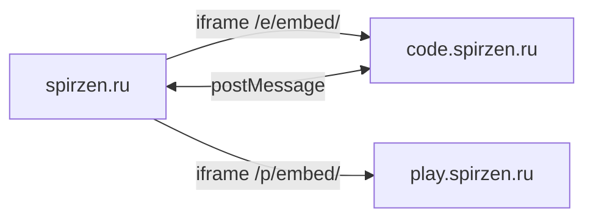

# IT Code Examples

**Каталог примеров кода для [Вселенной IT](https://spirzen.ru/) — ~2312 листингов**

| | |
|---|---|
| Публичный сайт | [code.spirzen.ru](https://code.spirzen.ru/) |
| Энциклопедия | [spirzen.ru](https://spirzen.ru/) |
| Интерактив | [play.spirzen.ru](https://play.spirzen.ru/) |
| Панель разработчика | [it-management](../it-management/) → `:8787` |

Длинные листинги и мультифайловые практикумы живут здесь; в статьях — текст и встроенный просмотрщик через iframe. Отдельный репозиторий даёт второй лимит GitHub Pages и не раздувает билд Docusaurus.

---

## Место в экосистеме



| Сервис | Репозиторий | Роль |
|--------|-------------|------|
| **spirzen.ru** | `it-knowledge-base` | Текст, навигация, DocSearch |
| **code.spirzen.ru** | `it-code-examples` (этот) | ~2312 примеров, Shiki, diff, серии |
| **play.spirzen.ru** | `it-play` | ~500 интерактивных демо |

**Правило:** код > ~30 строк или несколько файлов → здесь; короткие фрагменты (3–15 строк) — в markdown энциклопедии.

Интеграция: [`it-knowledge-base/info/ECOSYSTEM.md`](../it-knowledge-base/info/ECOSYSTEM.md).

---

## Возможности

- **Каталог** с `catalog-search` и фильтром по языку
- **Практикумы (серии)** — связанные примеры, навигация шаг 1…N
- **Версии и diff** — сравнение `v1/`, `v2/` из `meta.json`
- **Мультифайловые примеры** — вкладки, «Копировать все»
- **Копирование** и **полноэкранный просмотр** (postMessage `it-code-fullscreen`)
- **Светлая / тёмная тема** — синхрон с Docusaurus (`postMessage` `it-code-theme`)
- **Embed** для iframe в энциклопедии (авто-высота `it-code-embed-height`)

Подробности для агентов — [AGENTS.md](AGENTS.md).

---

## Стек

| Область | Технология |
|---------|------------|
| Сборка | [Astro 5](https://astro.build/) (`output: 'static'`) |
| Подсветка | [Shiki](https://shiki.style/) на этапе сборки (light + dark) |
| Runtime JS | Вкладки, catalog-search, тема, copy, fullscreen, embed-resize |
| Node.js | ≥ 20 |
| Деплой | GitHub Actions → GitHub Pages (`code.spirzen.ru`) |

---

## Быстрый старт

**Windows:** `start.bat` — Node.js, `npm install`, dev на **:4321**.

```bash
git clone https://github.com/spirzen/it-code-examples.git
cd it-code-examples
npm install
npm run dev    # http://localhost:4321/
npm run build  # dist/
npm run preview
```

Для проверки embed откройте энциклопедию на `:3000` (embed подтянутся автоматически) или используйте [it-management](../it-management/).

---

## Структура репозитория

```
it-code-examples/
├── examples/                    # ~2312 примеров
│   └── <язык>/<slug>/
│       ├── meta.json
│       └── *.ext
├── src/lib/examples.ts          # сканер, серии, поиск
├── src/pages/
│   ├── index.astro              # каталог + catalog-search
│   ├── series/[id].astro
│   └── e/embed/[...slug].astro  # iframe для энциклопедии
├── public/scripts/
│   ├── embed-resize.js          # it-code-embed-height
│   ├── theme.js                 # it-code-theme
│   └── catalog-search.js
├── scripts/migrate-*.mjs        # миграции из KB
└── AGENTS.md
```

---

## Контракт iframe (интеграция с spirzen.ru)

| Сообщение | Направление | Назначение |
|-----------|-------------|------------|
| `it-code-embed-height` | iframe → parent | `{ height: number }` |
| `it-code-theme` | parent → iframe | `{ theme: 'light' \| 'dark' }` |
| `it-code-fullscreen` | iframe → parent | `{ active: boolean }` |
| `it-code-fullscreen-close` | parent → iframe | закрытие по Escape |

CSP `frame-ancestors`: `spirzen.ru`, `localhost:3000`. Родитель: `ExternalCodeEmbed.jsx`, `CODE_EXAMPLES_TRUSTED_ORIGINS`.

В энциклопедии:

```jsx
<ExternalCodeEmbed example="python/hello-world" title="Python — Hello World" />
```

---

## URL (продакшен)

| Назначение | Путь |
|------------|------|
| Каталог | `/` |
| Полная страница | `/e/<язык>/<slug>/` |
| Embed | `/e/embed/<язык>/<slug>/` |
| Серия | `/series/<id>/` |

Prod env: `IT_CODE_EXAMPLES_SITE=https://code.spirzen.ru`, `IT_CODE_EXAMPLES_BASE=/`.

---

## Деплой

Push `main` → [`.github/workflows/deploy.yml`](.github/workflows/deploy.yml) → `dist/` → GitHub Pages.  
`scripts/postbuild.mjs` — legacy-зеркало `/it-code-examples/` и проверка канонических путей.

---

## Лицензия

| Часть | Лицензия |
|-------|----------|
| Код сайта | [MIT](LICENSE) |
| Примеры и тексты meta | [CC BY-NC-SA 4.0](https://creativecommons.org/licenses/by-nc-sa/4.0/) |

---

## Контакт

**Тагиров Тимур Владиславович** — [об авторе](https://spirzen.ru/about/author).
